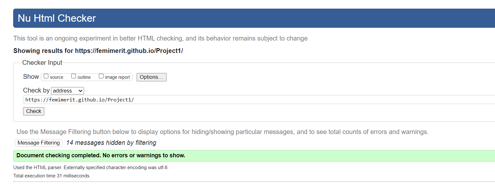
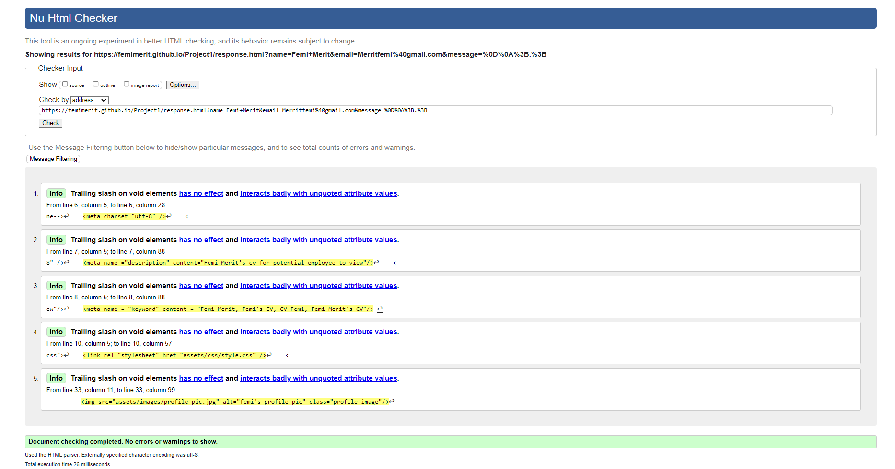
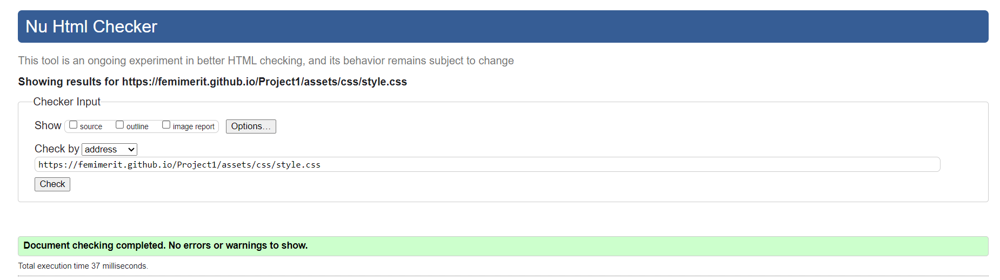
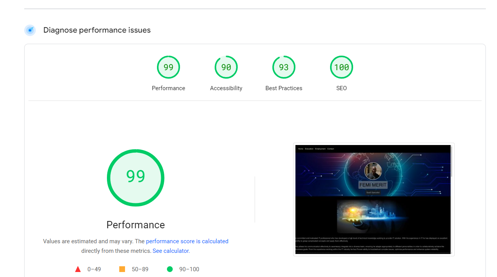

# TESTING

## Compatibility

In order to confirm the correct functionality, responsiveness, and appearance:

+ The website was tested on the following browsers: Chrome, Firefox, Brave.

    - Chrome:

    

    - FireFox:

    

    - Edge:

    

## Responsiveness

+ The website was checked by devtools implemented in Firefox and Chrome browsers.

    - Main Page:

    

    - Response Page:

    

+ The website was checked with [Responsive Website Design Tester](https://responsivedesignchecker.com/).

    - Desktop Screens:

    
    

    - Tablet Screens:

    

    - Mobile Screens:

    

+ The functionality of the links in the website was checked as well by different users.

## Manual testing

| feature | action | expected result | tested | passed | comments |
| --- | --- | --- | --- | --- | --- |
| Navbar | | | | | |
| Home | Click on the "Home" link | The user is redirected to the top of the page | Yes | Yes | - |
| Education | Click on the "Education" link | The user is redirected to the Education section | Yes | Yes | - |
| Employment | Click on the "Employment" link | The user is redirected to the Employment section | Yes | Yes | - |
| Contact | Click on the "Contact" link | The user is redirected to the Contact section | Yes | Yes | - |
| Contact page | | | | | |
|  Name input | Enter the Name| The name is entered | Yes | Yes | If user doesn't enter the first name, the error message appears |
| Email input | Enter the email | The email is entered | Yes | Yes | If user doesn't enter the email, the error message appears. If user enters not valid email, the error message appears |
| Message input | Enter the message | The message is entered | Yes | Yes | If user doesn't enter the email, the error message appears. If user enters nothing, the error message appears |
| "Submit" button | Click on the "Submit" button | The user is redirected to the response page | Yes | Yes | - |
| Response page | | | | | |
| Response message | The user can return to home page by clicking Home link | The user is redirected to the home page | Yes | Yes | - |

---
## Validator testing
+ ### HTML
  #### Home Page
    - some errors were found when passing through the official W3C validator.

    
    
  
  #### Response Page
    - No errors or warnings were found when passing through the official W3C validator.

    
    
+ ### CSS
  No errors or warnings were found when passing through the official W3C (Jigsaw) validator except:
    
  
  
  

+ ## LightHouse report

    - Using lighthouse I confirmed that the website is performing well, accessible and colors and fonts chosen are readable.
    
  ### Home page

  

  ### Response page

  

---
​
## Bugs
+ ### Solved bugs
    - The layout of the website did not translate when to mobile format. I used flex in css to help resolve the issue
+ ### Unsolved bugs
    - None.
+ ### Mistakes
    - Mistakes were made while committing changes. I used past simple tense in commits due to the habit when I just started working on this project.
    - While progressing in my code I learned to use present simple tense in commits.
---
